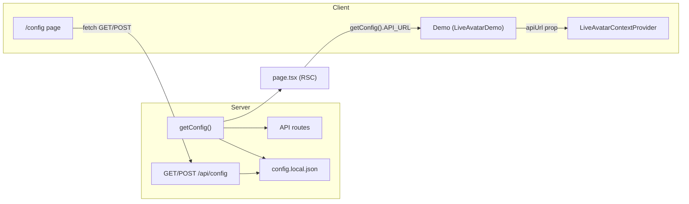

# Config page and local settings

## Current state

- **Single source of config:** [apps/demo/app/api/secrets.ts](apps/demo/app/api/secrets.ts) exports hardcoded values (including tokens). This file is committed and would be sent to GitHub.
- **Consumers:** All API routes and [apps/demo/src/liveavatar/context.tsx](apps/demo/src/liveavatar/context.tsx) import from `secrets.ts`. The context uses `API_URL` when creating the SDK session (line 187); that code runs on the client, so `API_URL` is currently bundled into the client.

**Settings in use:**

| Setting            | Used by                                                                      | Purpose             |
| ------------------ | ---------------------------------------------------------------------------- | ------------------- |
| API_KEY            | start-session, start-lite-session                                            | LiveAvatar API auth |
| API_URL            | start-session, start-lite-session, keep-session-alive, stop-session, context | LiveAvatar base URL |
| AVATAR_ID          | start-session, start-lite-session                                            | Avatar identifier   |
| VOICE_ID           | start-session                                                                | FULL mode voice     |
| CONTEXT_ID         | start-session                                                                | FULL mode context   |
| LANGUAGE           | start-session                                                                | FULL mode language  |
| IS_SANDBOX         | start-session, start-lite-session                                            | Sandbox flag        |
| ELEVENLABS_API_KEY | elevenlabs-text-to-speech                                                    | LITE mode TTS       |
| OPENAI_API_KEY     | openai-chat-complete                                                         | LITE mode chat      |

---

## Approach: local JSON file + API

- **Persist** settings in a **single local file** (e.g. `apps/demo/config.local.json`) that is **gitignored**, so it is never committed and stays local.
- **Server** reads this file at runtime (per request) so changes take effect without restart.
- **Config UI** at `/config` loads and saves via **GET/POST /api/config**; only the config page and trusted local use should have write access (e.g. restrict in production or document as dev-only).

No secrets in repo, no env vars required for basic use; optional: allow `process.env` overrides for production (e.g. Vercel).

---

## 1. Config storage and loader

- **File:** `apps/demo/config.local.json` (create only when user first saves from UI; add to [.gitignore](apps/demo/.gitignore) or root [.gitignore](.gitignore)).
- **Shape:** One key per setting; match current names (e.g. `API_KEY`, `API_URL`, `AVATAR_ID`, `VOICE_ID`, `CONTEXT_ID`, `LANGUAGE`, `IS_SANDBOX`, `ELEVENLABS_API_KEY`, `OPENAI_API_KEY`). Use strings and boolean for `IS_SANDBOX`.
- **Loader:** Refactor [apps/demo/app/api/secrets.ts](apps/demo/app/api/secrets.ts):
  - Implement `**getConfig()`** (server-only): read `config.local.json` from disk (path relative to app root, e.g. `path.join(process.cwd(), 'config.local.json')` or resolve from `__dirname`), parse JSON, merge with **defaults\*\* (current hardcoded values as fallback). Optionally merge with `process.env` so env can override (e.g. `LIVEAVATAR_API_KEY`).
  - **Do not** export individual constants; export only `getConfig()` so every read is from file + env + defaults. Call `getConfig()` inside each API route and in the place that passes config to the client (see below).
- **Safety:** `getConfig()` and config file path must only be used in **server** code (API routes, server components). Never import the file reader or raw config into client components.

---

## 2. API routes for config (read/write)

- **GET /api/config** (in e.g. [apps/demo/app/api/config/route.ts](apps/demo/app/api/config/route.ts)): Call `getConfig()`, return JSON. Used by the `/config` page to load current values. Optional: in production, return 403 or read-only subset if you want to avoid exposing secrets via this endpoint.
- **POST /api/config** (same route file): Accept JSON body with the same keys. Validate types (strings, boolean for `IS_SANDBOX`). Write to `config.local.json` (same path as loader). Ensure directory exists; write atomically (write to temp file then rename) if possible. Return success or validation error. Optional: restrict to `NODE_ENV === 'development'` or a secret header so production cannot overwrite config from the UI.

---

## 3. Use config in API routes

- Replace every `import { X } from "../secrets"` with: call `getConfig()` and use the returned object.
- **Files to update:**
  - [apps/demo/app/api/start-session/route.ts](apps/demo/app/api/start-session/route.ts)
  - [apps/demo/app/api/start-lite-session/route.ts](apps/demo/app/api/start-lite-session/route.ts)
  - [apps/demo/app/api/keep-session-alive/route.ts](apps/demo/app/api/keep-session-alive/route.ts)
  - [apps/demo/app/api/stop-session/route.ts](apps/demo/app/api/stop-session/route.ts)
  - [apps/demo/app/api/elevenlabs-text-to-speech/route.ts](apps/demo/app/api/elevenlabs-text-to-speech/route.ts)
  - [apps/demo/app/api/openai-chat-complete/route.ts](apps/demo/app/api/openai-chat-complete/route.ts)

Example pattern: at top of handler, `const config = getConfig();` then use `config.API_KEY`, `config.API_URL`, etc.

---

## 4. Passing API_URL to the client (no secrets in client bundle)

- The client currently gets `API_URL` from [apps/demo/src/liveavatar/context.tsx](apps/demo/src/liveavatar/context.tsx) via `import { API_URL } from "../../app/api/secrets"`. To use the local config file, the client must not import from `secrets`; instead, **API_URL must be provided as a prop** from a server component that calls `getConfig()`.
- **Flow:**
  - **Server:** [apps/demo/app/page.tsx](apps/demo/app/page.tsx) becomes a **server component**: call `getConfig()`, get `API_URL`, pass it as a prop to the client tree (e.g. `<LiveAvatarDemo apiUrl={getConfig().API_URL} />`).
  - **Client:** [apps/demo/src/components/LiveAvatarDemo.tsx](apps/demo/src/components/LiveAvatarDemo.tsx) accepts `apiUrl: string`, passes it to `LiveAvatarSession`. [apps/demo/src/components/LiveAvatarSession.tsx](apps/demo/src/components/LiveAvatarSession.tsx) passes it to `LiveAvatarContextProvider`. [apps/demo/src/liveavatar/context.tsx](apps/demo/src/liveavatar/context.tsx) `LiveAvatarContextProvider` accepts optional `apiUrl?: string` and uses it when creating `LiveAvatarSession` (instead of importing `API_URL`). If `apiUrl` is missing (e.g. old callers), fall back to a safe default or the same default used in `getConfig()` so the app still runs before any config is saved.
- This keeps the client bundle free of server-side config; only the value passed from the server is used.

---

## 5. Config page UI at /config

- **Route:** [apps/demo/app/config/page.tsx](apps/demo/app/config/page.tsx). Use a **client component** (or a server component that renders a client form) so the form is interactive.
- **Load:** On mount, `fetch('/api/config')` and populate form state.
- **Form fields:** One input per setting; use **password** inputs for `API_KEY`, `ELEVENLABS_API_KEY`, `OPENAI_API_KEY`; **text** for URLs and IDs; **toggle** for `IS_SANDBOX`. Group by section (e.g. “LiveAvatar”, “FULL mode”, “LITE mode”) and add short labels/placeholders so it’s clear what each field is for.
- **Save:** Button submits current values to `POST /api/config` with `Content-Type: application/json`. Show success or error message. Optional: “Reset to defaults” that POSTs the default values.
- **Navigation:** Add a link to `/config` from the main demo page (e.g. header or footer) and a link back to “Demo” or “Home” on the config page.
- **Loading/error:** Handle loading state while fetching config; show a message if GET /api/config fails (e.g. no file yet).

---

## 6. Defaults and first run

- When `config.local.json` **does not exist**, `getConfig()` returns the current hardcoded defaults (same as today). So the app works before the user ever visits `/config`.
- Optional: add a **committed** `config.example.json` (or `config.local.example.json`) with placeholder values (e.g. `"YOUR_API_KEY"`) and no real secrets, so users know the expected keys and can copy to `config.local.json` if they prefer editing the file by hand.

---

## 7. .gitignore and security

- Add `config.local.json` to [.gitignore](.gitignore) (or `apps/demo/.gitignore` if present) so the file is never committed. Document in README or in the config page that settings are stored locally and not sent to GitHub.
- **Recommendation:** Remove or redact real tokens from [apps/demo/app/api/secrets.ts](apps/demo/app/api/secrets.ts) so that file only exports `getConfig()` and the default values used when no file exists; no real API keys in the repo.

---

## Summary diagram

---

## Files to add

- `apps/demo/app/config/page.tsx` – config page UI (client form).
- `apps/demo/app/api/config/route.ts` – GET (read config), POST (write config).
- `apps/demo/config.local.json` – only created when user saves; add to .gitignore.
- Optional: `apps/demo/config.example.json` – example keys, no secrets.

## Files to modify

- `apps/demo/app/api/secrets.ts` – replace exports with `getConfig()` and defaults.
- All 6 API route files listed above – use `getConfig()` instead of direct imports.
- `apps/demo/app/page.tsx` – server component that passes `apiUrl` from `getConfig()` to `LiveAvatarDemo`.
- `apps/demo/src/components/LiveAvatarDemo.tsx` – accept `apiUrl` prop and pass to `LiveAvatarSession`.
- `apps/demo/src/components/LiveAvatarSession.tsx` – accept `apiUrl` prop and pass to `LiveAvatarContextProvider`.
- `apps/demo/src/liveavatar/context.tsx` – accept `apiUrl` prop in provider and use it instead of importing `API_URL`.
- `.gitignore` (or `apps/demo/.gitignore`) – add `config.local.json`.

## Order of implementation

1. Add `getConfig()` and defaults in `secrets.ts`; add `config.local.json` to .gitignore.
2. Add GET/POST `/api/config` route.
3. Update all API routes to use `getConfig()`.
4. Add `apiUrl` prop chain (page → LiveAvatarDemo → LiveAvatarSession → context) and remove client import of secrets.
5. Build `/config` page and link from the main UI.
