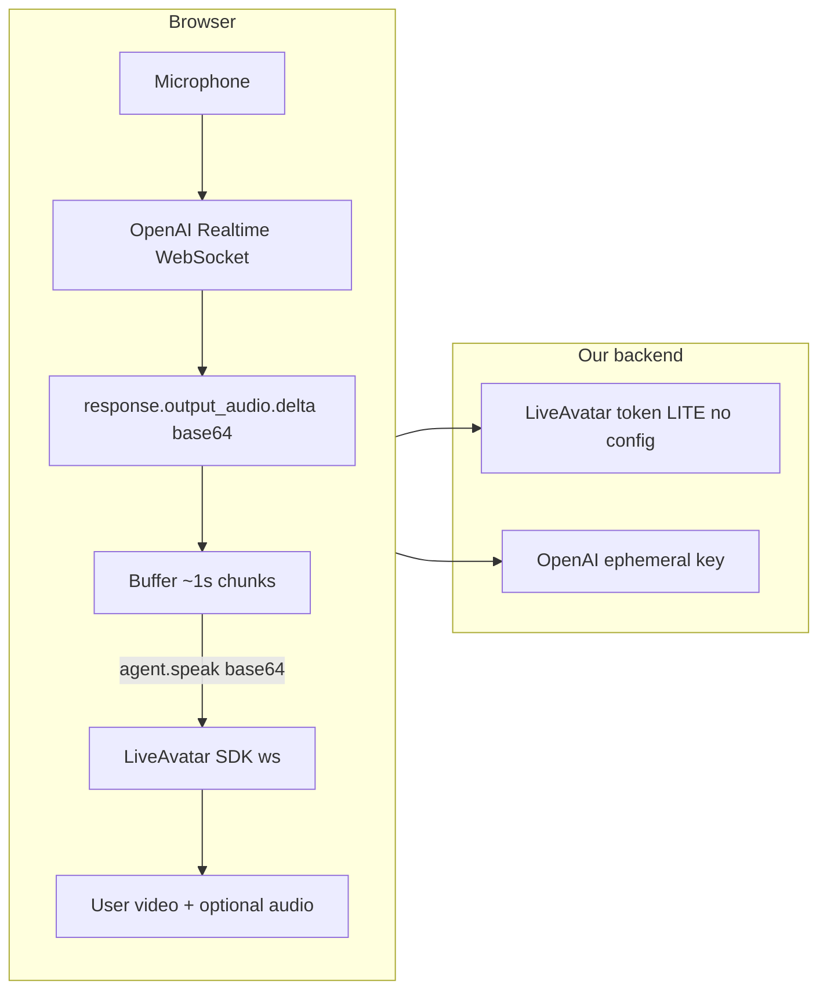

# True LITE: We Manage Realtime, LiveAvatar for Lipsync (revised)

## Goal

- **Option A (True LITE):** We create/update the OpenAI Realtime session (instructions or `prompt.id`), receive audio from OpenAI, and send that audio to LiveAvatar via LITE protocol (`agent.speak` with PCM 16-bit 24 kHz base64). LiveAvatar is used only for avatar/lipsync (no `openai_realtime_config`). This matches what LiveAvatar documents LITE to be: they provide WebRTC room/transport; we are responsible for ASR/LLM/TTS and drive the avatar via the websocket event channel.
- **Keep current setup (B):** Leave existing LITE flow as-is; in config and UI, describe it as "LiveAvatar-managed OpenAI Realtime" with limitations (instructions may not be forwarded; only fields LiveAvatar supports apply). Context ID is a FULL-mode concept; in LITE the “context” equivalent is the OpenAI session (instructions or Prompt ID).

## Context in True LITE

- **LiveAvatar `context_id`** is FULL-mode only (persona/context). Not used in LITE.
- **True LITE “context”** = OpenAI session control: set **instructions** (system prompt text) and/or **OpenAI Prompt ID** (`pmpt_...`) via `session.update` (or in session config when creating the session). That is the correct place for “context” in Option A.

## Audio format (lossless piping)

- **OpenAI Realtime:** Explicitly configure **output** to **pcm16 @ 24kHz** so it matches LiveAvatar. Configure **input** to pcm16 @ 24kHz mono little-endian for a consistent end-to-end chain.
- **LiveAvatar `agent.speak`:** PCM 16-bit 24 kHz, base64; ~1s chunks recommended; <1MB.
- Result: OpenAI output can be buffered and forwarded to LiveAvatar without resampling or re-encoding.

**OpenAI audio format (exact schema):** Naming differs across OpenAI docs — e.g. `output_audio_format: "pcm16"` in API reference (pcm16 → 24kHz) vs `audio: { input/output: { format: { type: "audio/pcm", rate: 24000 }}}` in guides. Functionally the same target (PCM @ 24kHz). **Implementation:** Use the **exact schema** for the endpoint/event we use — match the payload shape for **client_secrets** session config vs **session.update** per the API reference you’re calling.

**LiveAvatar LITE events (defensive coding):** Docs have small inconsistencies. Use the **JSON `type` value** from the API, not the row label (e.g. send/receive `"type": "agent.speak_end"`, not `avatar.speak_end`). The server event `agent.speak_ended` example in the docs may have a typo (e.g. `type` shown as `"agent.speak_started"`). **Do not hardcode from the example alone:** log actual events from LiveAvatar and branch on what we receive.

## V1 happy path: WebSocket for MVP (guaranteed deltas)

- **Preferred for MVP:** Use **OpenAI Realtime over WebSocket** so we can reliably consume `response.output_audio.delta` (base64) and pipe it straight into LiveAvatar. OpenAI explicitly documents buffering these delta events for streaming audio elsewhere. This avoids dead-ends on the first version.
- **WebRTC later:** Add WebRTC for lower latency once the piping works. If deltas aren’t exposed in the WebRTC path, fall back to **decode audio track → PCM16 → base64** (e.g. audio worklet).
- **OpenAI’s separation:** WebRTC is the media path (audio on tracks); WebSocket is the explicit event/delta path. For v1 we lock in WebSocket.

## Minimum MVP definition of done

Implement **only** this first:

1. **LiveAvatar LITE:** Token with no `openai_realtime_config`; connect websocket; send `session.keep_alive` periodically.
2. **OpenAI Realtime over WebSocket:** Session with `instructions` and/or `prompt: { id: "pmpt_..." }`, plus `output_audio_format: "pcm16"` (24kHz). Ephemeral key from **POST /v1/realtime/client_secrets** (OpenAI deprecates the older “create session” approach; use client_secrets). Request key immediately before connecting; handle TTL/retry.
3. **Audio pipe:** Buffer `response.output_audio.delta` (base64) into ~1s chunks; forward as `agent.speak`, then `agent.speak_end`.

**Once that works,** add: interrupt handling, listening state events (`agent.start_listening` / `agent.stop_listening`), reconnection logic.

## Architecture (True LITE) — MVP

- **LiveAvatar:** Token with `mode: "LITE"`, `avatar_id`, **no** `openai_realtime_config`. Session start returns `ws_url` and LiveKit room for video. We send `agent.speak` / `agent.speak_end`, and `session.keep_alive` (MVP); later add listening state and interrupt.
- **OpenAI (MVP):** **WebSocket** session in browser. Session config: **pcm16 @ 24kHz** (output*audio_format: "pcm16"); `instructions` and/or `prompt.id` (`pmpt*...`); voice/model. Consume `response.output_audio.delta` and pipe to LiveAvatar. WebRTC can be added later for lower latency.

## Key references

- **LiveAvatar LITE:** [Configuring Custom Mode](https://docs.liveavatar.com/docs/configuring-custom-mode), [LITE Mode Events](https://docs.liveavatar.com/docs/custom-mode-events) — `agent.speak` PCM 16-bit 24 kHz base64, ~1s chunks, <1MB; `session.keep_alive`; listening state.
- **OpenAI Realtime:** [Realtime API](https://platform.openai.com/docs/guides/realtime), [WebRTC](https://platform.openai.com/docs/guides/realtime-webrtc), session.update — **audio.output** with format pcm16 / 24kHz; `instructions` or `prompt.id`; ephemeral key via **POST /v1/realtime/client_secrets** (OpenAI deprecates older “create session” approach). Keys expire after **1 minute**; client must request immediately before connecting; implement refresh/retry logic.

## 1. Config and backend

- Add **True LITE** toggle (`USE_TRUE_LITE`) and optional **OpenAI Prompt ID** (`OPENAI_REALTIME_PROMPT_ID`, `pmpt_...`). Keep existing LITE/Realtime fields.
- **Session start:** For True LITE, call LiveAvatar `POST /v1/sessions/token` with `mode: "LITE"`, no `openai_realtime_config`; return mode e.g. `LITE_TRUE`.
- **Ephemeral key route:** Use **POST /v1/realtime/client_secrets** (OpenAI deprecates the older “create session” approach). Build session config with **output_audio_format: "pcm16"** (24kHz), `instructions`, and optionally `prompt: { id: "pmpt_..." }`; return the key. **TTL:** keys expire after **1 minute**. Client must request the key **immediately before** connecting; implement **refresh/retry** logic.
- **Config summary:** Expose True LITE when `USE_TRUE_LITE` and required fields are set.
- **Config page:** Describe current B as "LiveAvatar-managed"; add True LITE section with instructions and optional Prompt ID.

## 2. Client: True LITE flow

- Start LiveAvatar session **without** voice chat (we only need room + `ws_url`). Establish **OpenAI Realtime over WebSocket** (MVP) with **output_audio_format: "pcm16"** and instructions / `prompt.id`.
- **Audio pipeline (MVP):** Consume `**response.output_audio.delta`** (base64) from the WebSocket event stream; buffer into ~1s chunks; send as `agent.speak`, then `agent.speak_end`. Lossless: OpenAI pcm16 24kHz base64 matches LiveAvatar. **Keep-alive:\*\* Send `session.keep_alive` to LiveAvatar periodically (e.g. every 2–3 min).
- **After MVP:** Add interrupt handling (`agent.interrupt` + clear buffer), listening state (`agent.start_listening` / `agent.stop_listening`), reconnection logic. Optionally add WebRTC for OpenAI later (with track-extraction fallback if deltas aren’t exposed).

## 3. SDK and format

- LiveAvatar expects **base64** PCM 16-bit 24kHz. Ensure we send base64 (extend SDK or send events ourselves if the current SDK does not send base64). When parsing LiveAvatar server events, use the actual `type` from the payload; log and branch on received events rather than relying on doc examples.
- OpenAI session: set audio output (and input) to **pcm16, 24kHz** using the **exact schema** for the endpoint in use (client_secrets request body vs session.update event) per the API reference.

## 4. Files to touch

- Config/secrets: `USE_TRUE_LITE`, optional `OPENAI_REALTIME_PROMPT_ID`; validation.
- Session start: True LITE branch (LITE token, no `openai_realtime_config`).
- New route: ephemeral key (client_secrets) with session config (output_audio_format pcm16, instructions, prompt.id).
- Config summary and config page: True LITE + current B description.
- Demo and session component: True LITE branch; `voiceChat: false`; **OpenAI Realtime WebSocket** client; buffer `response.output_audio.delta` → `agent.speak` / `agent.speak_end`; `session.keep_alive`. Then add interrupt, listening state, reconnection.

## 5. What we do not change

- Current LITE (B) path unchanged. FULL / FULL_PTT unchanged.
